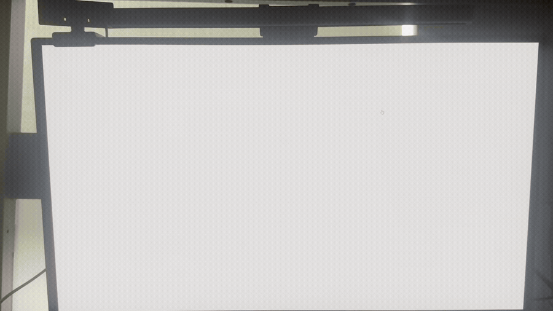

# Brightness Adjuster

Brightness Adjuster is a lightweight Windows system-tray utility that adapts every connected display to the lighting around you. It estimates ambient light from the default webcam, smooths the reading over time, and applies the result through the Win32 gamma-ramp API.

> Brightness Adjuster changes the image sent to each display; it does not control the monitor's physical backlight.

## Demo

> The display is filmed externally because Windows gamma-ramp changes are applied after the normal screen-capture stage and therefore do not appear in conventional screen recordings.
>
> The demo uses intentionally exaggerated configuration settings to make the brightness changes easy to see. The default settings produce smoother, more gradual adjustments.



## Features

- Estimate ambient light continuously from the default webcam
- Adjust every detected display automatically
- Smooth transitions with separate brightening and darkening speeds
- Limit both the brightness range and the maximum rate of change
- Ignore tiny fluctuations with a configurable dead zone
- Run quietly from the Windows system tray
- Save configuration under the current user's roaming AppData folder
- Restore each display's original gamma ramp during a normal shutdown

## How It Works

Every 100 milliseconds, Brightness Adjuster reads a frame from the webcam and converts it from BGR to HSV. The mean value of the HSV brightness channel is used as the current light estimate.

The application then:

1. Normalizes the light estimate against the configured neutral-light value.
2. Maps that value to a target brightness with a logarithmic response curve.
3. Adds the configured offset and clamps the result to the minimum and maximum brightness.
4. Smooths the transition using separate brightening and darkening rates.
5. Caps the change per second to prevent abrupt jumps.
6. Scales the original red, green, and blue gamma ramps for every detected display and applies them with `SetDeviceGammaRamp`.

Each display's original gamma ramp is kept in memory and restored when the application exits normally. Webcam frames are processed locally and are not saved or transmitted by the application.

## Requirements

- Windows 10 or Windows 11
- Python 3
- A webcam accessible to OpenCV
- A display and graphics driver that support the Windows gamma-ramp API

## Getting Started

Clone the repository and enter the project directory:

```powershell
git clone https://github.com/Ragno4556/brightness-adjuster.git
cd brightness-adjuster
```

Create a virtual environment and install the dependencies:

```powershell
py -m venv .venv
.venv\Scripts\Activate.ps1
py -m pip install -r requirements.txt
```

Run the application:

```powershell
py main.py
```

The application begins adjusting brightness immediately and remains available from the system tray. Right-click its tray icon and select **Exit** to stop it and restore the original gamma ramps.

## Configuration

On first launch, the application creates:

```text
%APPDATA%\AutoBrightness\settings.ini
```

Close Brightness Adjuster before editing the file, then restart the application to load the new values.

| Setting | Default | Purpose |
| --- | ---: | --- |
| `neutral_light_value` | `105` | Webcam brightness treated as the reference lighting level |
| `min_brightness` | `0.35` | Lowest allowed gamma-ramp multiplier |
| `max_brightness` | `1.25` | Highest allowed gamma-ramp multiplier |
| `dead_zone` | `0.01` | Target difference ignored to reduce small oscillations |
| `brighten_speed` | `2.5` | Smoothing rate when the display is getting brighter |
| `darken_speed` | `1.0` | Smoothing rate when the display is getting darker |
| `brightness_offset` | `0.08` | Constant adjustment added to the calculated target |
| `max_brightness_change_per_second` | `0.4` | Maximum permitted change in the multiplier per second |

The generated file has this format:

```ini
[settings]
neutral_light_value = 105
min_brightness = 0.35
max_brightness = 1.25
dead_zone = 0.01
brighten_speed = 2.5
darken_speed = 1.0
brightness_offset = 0.08
max_brightness_change_per_second = 0.4
```

For the same room lighting, increasing `neutral_light_value` produces a darker target and decreasing it produces a brighter target. Use `brightness_offset` for smaller overall corrections. Higher speed values respond more quickly; lower values create gentler transitions.

## Limitations

- Brightness Adjuster currently supports Windows only.
- The first camera reported by OpenCV is used; camera selection is not currently configurable.
- Every detected display receives the same brightness multiplier.
- Camera auto-exposure and the webcam's position can affect the light estimate.
- Gamma-ramp behavior depends on the display, graphics driver, and other software that modifies display color.
- Values above `1.0` cannot increase the monitor's physical luminance and may clip the brightest gamma-ramp entries.
- Slight display flickering may occur on some systems while gamma ramps are being updated.
- A forced termination or system crash can prevent the original gamma ramps from being restored automatically.

## Project Structure

```text
brightness-adjuster/
|-- docs/
|   `-- brightnessadjuster-demo.gif
|-- icon.ico
|-- main.py
|-- requirements.txt
`-- README.md
```

## License

Brightness Adjuster is available under the [MIT License](LICENSE).
